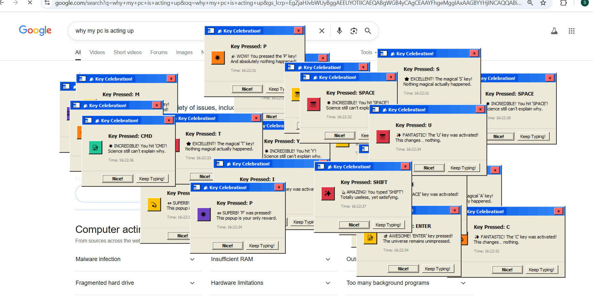
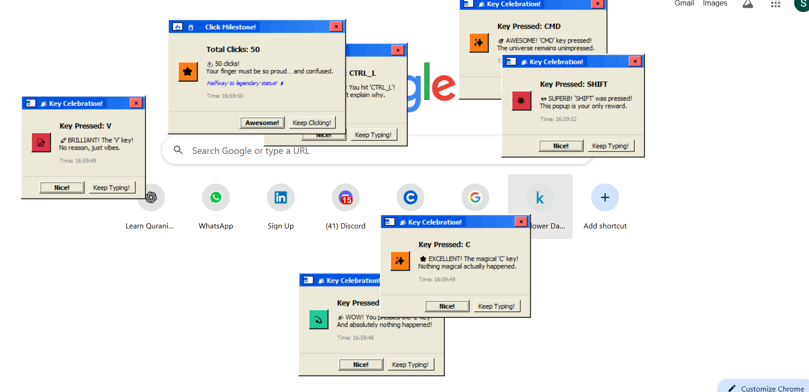

img width="3188" height="1202" alt="frame (3)" src="https://github.com/user-attachments/assets/517ad8e9-ad22-457d-9538-a9e62d137cd7" />


# 🤖 S.A.S.S.Y. — Sentient Automated Sarcasm & Snark Yielder 🎯


## Basic Details
### Team Name: Shyma Zuhra


### Team Members
- Team Lead: Shyma Zuhra - GEC Kozhikode


### Project Description
S.A.S.S.Y. is a completely pointless Python program that acts like it’s self-aware.
Its mission? To interrupt your day with popups, sarcastic voice comments, and milestone celebrations that mean absolutely nothing.

### The Problem (that doesn't exist)
Let’s face it, your computer is way too quiet, your CPU works too hard without thanks, and your mouse & keyboard clicks go completely uncelebrated.

This leads to:

- Severe lack of sass in your computing life 🥱

- Unmotivated keystrokes and mouse clicks 😔

- CPUs feeling underappreciated 💔

### The Solution (that nobody asked for)
Useless Sassy Sentient System — the software equivalent of that one overly dramatic friend who has to comment on everything you do.

This groundbreaking innovation will:

- Interrupt your peace every 10 seconds with pop-ups you never wanted 🛎️

- Verbally judge your CPU for working too hard or hardly working 🎙️

- Celebrate your mouse clicks like you just won the Olympics 🖱️🥇

- Applaud random key presses as if you’ve typed the cure for boredom ⌨️👏

- Add unnecessary chaos to your otherwise peaceful computing experience 🤯

In short:
It solves absolutely nothing.
It fixes problems that never existed.
It’s here because… why not? 🤷‍♂️

## Technical Details
### Technologies/Components Used
For Software:
- **Languages used**: Python 🐍

- **Libraries used:**  
  - `psutil` – to stalk your CPU usage  
  - `pyttsx3` – to make your computer talk back to you  
  - `tkinter` – for those *in-your-face* pop-up windows  
  - `pynput` – to spy on your keyboard presses and mouse clicks  
  
- **Tools used:**  
  - Git & GitHub – for version control (and to make this chaos shareable)  
  - Your patience – because you’ll need it  


### Implementation
1. **Check CPU Usage**  
   Every 10 seconds, the script politely (and unnecessarily) checks your CPU usage using `psutil`.  
   Why? No reason. Just because it can.  

2. **Spawn Pop-ups**  
   Depending on the CPU usage, `tkinter` creates pop-up messages filled with sarcasm, sass, and complete irrelevance.  

3. **Talk to You (Like You Asked for It)**  
   Using `pyttsx3`, the system reads these useless comments out loud — because silence is overrated.  

4. **Track Mouse Clicks & Keyboard Presses**  
   With `pynput`, every click and key press is counted.  
   When you reach completely arbitrary milestones (like 10, 20, 30, 50, 100 clicks),  
   the system celebrates with a *special* pop-up and audio commentary. 🎉  

5. **Repeat Forever**  
   This continues until you either:  
   - Close the program, or  
   - Lose your patience entirely.  
# Installation
1. **Clone this ridiculously unnecessary project**  
   ```bash
   git clone https://github.com/shyma22/useless_proj.git

   cd useless_proj
   ```


# Run
```bash
python main.py
```

### Project Documentation
**Useless Sassy System** is a Python-powered annoyance generator that nobody asked for, yet here it is.  
It watches your computer’s activity like an over-caffeinated digital stalker and throws pop-ups at you  
every 10 seconds with sarcastic, pointless commentary.

But wait, there’s *less*!  
- **CPU Usage Watchdog**: Every 10 seconds, it checks your CPU usage and mocks/praises you for…  
  basically doing nothing.
- **Mouse Click Tracker**: Tracks how many times you’ve clicked your mouse. Celebrates completely  
  unnecessary milestones like *10 clicks* as if you’ve discovered fire.
- **Keyboard Key Press Tracker**: Because every keystroke deserves an audience… right?  
  Get ready for pop-ups that applaud you for typing a single letter.
- **Voice Commentary**: Using `pyttsx3`, your PC *literally talks* to you in a sassy tone.  
  Imagine your computer roasting you out loud.
- **Milestone Celebrations**: Every so often, you hit a “milestone” like 50 clicks or 100 key presses,  
  and the system throws you a party you never wanted.

---

#### 🤷 Why is it useless?  
Because it **solves no problem** at all.  
In fact, it *creates* problems by distracting you, eating a tiny amount of CPU, and giving you  
absolutely no valuable feedback about your system.  
It’s the equivalent of a clingy digital friend who keeps texting you “Hey, just thinking about you”  
but in pop-up form.

---

# Screenshots 

*Pop-ups*


*Pop-ups lol*


*More pop-ups lol*


### Project Demo
# Video
*unfortunately, the pop-up doesn't show up on screen-recording*


## Team Contributions
- Shyma Zuhra: Literally everything


---
Made with ❤️ at TinkerHub Useless Projects 


